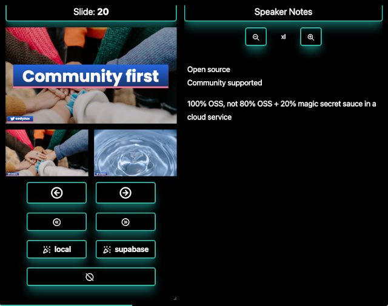
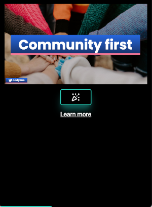

# present

## *Crazy interactive presentation framework 🎉*

<br><br>


_Main presentation view_


<br><br>



_Speaker view with notes_

<br><br>



_Mobile friendly audience view... go ahead, throw some confetti on the main screen 🎉!_

<br><br>

## Quickstart

1. Create an account at `/signin`
1. Upload a 16x9 pdf presentation to `/upload`
1. Enjoy

### Install

```bash
pnpm run install
```

### Build

```bash
pnpm run build
```

### Debug

```
pnpm run dev
```

## Techstack

Uses supabase to broadcast messages from the client view to the presentation view.

In order to build, the following env vars must be set:

- `VITE_SUPABASE_URL` supabase url
- `VITE_SUPABASE_KEY` supabase key
